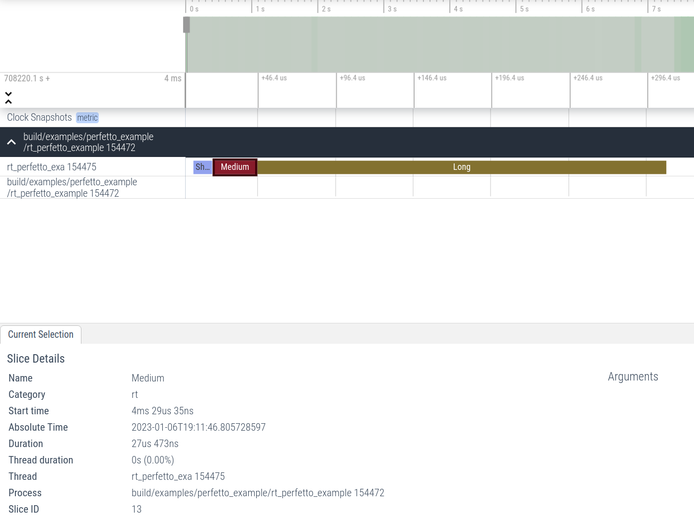

Perfetto tracing example
========================

The idea is to use Perfetto to trace regions in the code to gain insights into
how fast user code is running.

To run this, build it, then run:

```
$ sudo build/examples/perfetto_example/rt_perfetto_example
```

This will create a file called `example.perfetto-trace`. This file can be loaded
in https://ui.perfetto.dev (this will not actually upload any data as the trace
visualizer hosted at the domain promises to process the trace data locally in
the browser).

In the browser, you can see three regions in the timeline view: `Short`,
`Medium`, and `Long` similar to:



You can use the SQL and find the min, max, average runtime of one of the regions:

```
SELECT MIN(dur), AVG(dur), MAX(dur) FROM slice WHERE cat = "rt" AND name = "Long";
```

Which in my case returns:

```
MIN(dur)	AVG(dur)	MAX(dur)
254116	278517.8715128487	732369
```

The `dur` column is the duration in nanoseconds.